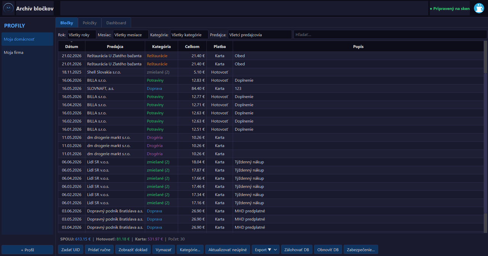
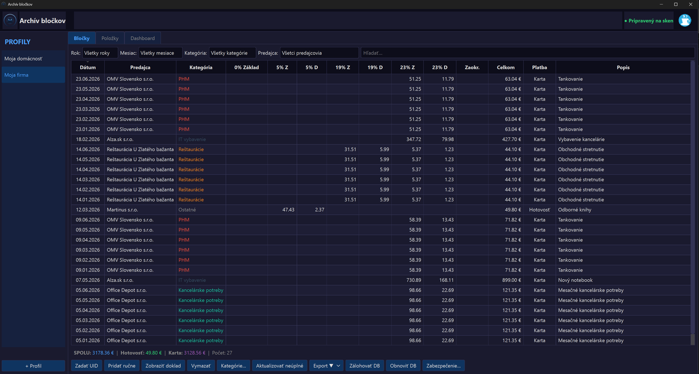
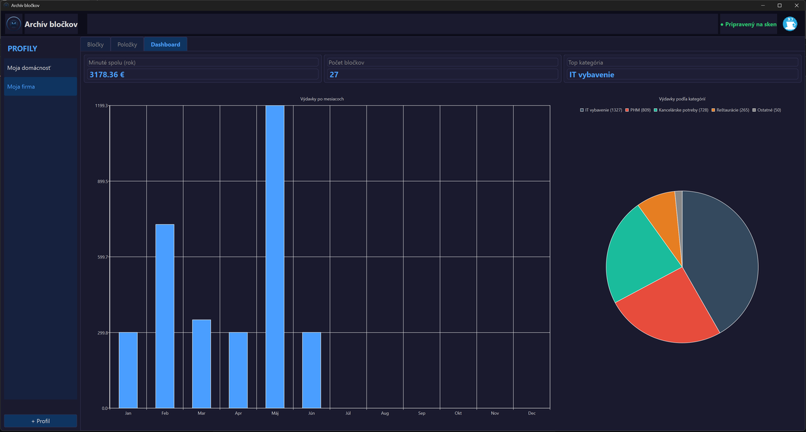
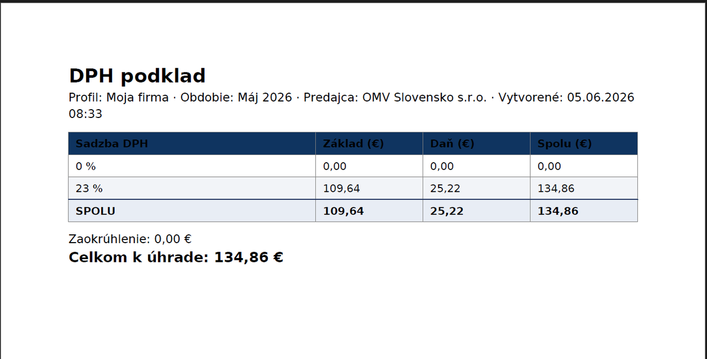

# Archív bločkov

Desktopová aplikácia (**Windows aj Linux**) na **archiváciu slovenských
e-kasa bločkov** naskenovaných cez USB QR skener. Na rozdiel od účtovníckej
appky `Scan_blocky` ide o **osobný/firemný archív** bez hierarchie klientov —
bločky sa zakladajú podľa **dátumu z QR kódu** a triedia do **profilov**
a **kategórií**.

Postavená na **PySide6 (Qt)**, dáta v lokálnej **SQLite** databáze.

> **Potrebný hardvér:** na skenovanie bločkov je nutný **2D (QR) čítačka
> čiarových kódov** pripojená cez USB (správa sa ako klávesnica). Bežná 1D
> laserová čítačka **nestačí** — QR kódy na e-kasa bločkoch sú dvojrozmerné.
> Bločky sa dajú zadať aj ručne (tlačidlo „Zadať UID" alebo „Pridať ručne"),
> takže čítačka nie je nevyhnutná na vyskúšanie aplikácie.

---

## Hlavné funkcie

- **Viac profilov** (napr. „Moja domácnosť", „Moja firma") — každý profil má
  vlastné bločky, kategórie, predajcov aj aliasy.
- **Zakladanie podľa dátumu z QR** — januárový bloček naskenovaný v októbri
  sa zaradí do januára.
- **Skenovanie / zadanie UID** — USB **2D (QR) čítačka** (funguje ako
  klávesnica), online aj offline (`OKP:…`) bločky vrátane položiek; neúplné
  bločky sa automaticky dopĺňajú, keď ich pokladnica nahrá do eKasa.
- **Hromadné skenovanie** — samostatné okno na rýchle naskenovanie viacerých
  bločkov za sebou; ukladajú sa ticho s predvolenou kategóriou predajcu.
- **Kategórie na úrovni položiek** — celý bloček dostane predvolenú kategóriu,
  jednotlivé položky sa dajú prepísať; učenie predvolenej kategórie podľa IČO.
- **Univerzálny režim DPH** — firemný profil ukáže rozpad DPH (0/5/19/23 %),
  domácnostný ho skryje.
- **Detail dokladu** — verná tlačiteľná kópia každého uloženého bločku
  (offline, z uloženého `api_data`) vrátane QR kódu.
- **Vyhľadávanie položiek a reporty spotreby** — hľadanie naprieč položkami
  (napr. „chlieb"), mesačné reporty množstva a sumy, **graf vývoja ceny**,
  **aliasy** na zlúčenie variantov názvov; **dvojklik na položku** otvorí
  pôvodný doklad, na ktorom sa nachádza.
- **Exporty** — PDF (prehľad bločkov, súhrn kategórií, report položky,
  DPH podklad), Excel/CSV.
- **Dashboard** — grafy výdavkov po mesiacoch a podľa kategórií (QtCharts).
- **Záloha a obnova databázy** — bezpečná obnova s validáciou a automatickou
  zálohou pred prepisom.
- **Voliteľná ochrana heslom** (bcrypt) — používateľ si sám zvolí, či chce
  aplikáciu heslovať; predvolene je vypnutá.
- **Súkromie — všetko lokálne, žiadny cloud** — bločky aj všetky dáta sa
  ukladajú výhradne do lokálnej SQLite databázy vo vašom počítači. Aplikácia
  nikam neposiela vaše údaje; jediné sieťové volania sú dopyty do verejných
  registrov eKasa a registeruz.sk pri rozpoznaní bločku a predajcu.

---

## Náhľady

**Zoznam bločkov (domácnosť)**



**Zoznam bločkov s rozpadom DPH (firemný profil)**



**Dashboard — výdavky po mesiacoch a podľa kategórií**



**PDF export — DPH podklad**



---

## Stiahnutie hotovej aplikácie

Najnovšie zostavenie nájdete na stránke
**[Releases](https://github.com/Orimslav/archiv_blockov/releases/latest)**:

| Systém | Súbor | Spustenie |
|--------|-------|-----------|
| **Windows** | `ArchivBlockov.exe` | dvojklik — netreba inštaláciu ani Python |
| **Linux** | `ArchivBlockov-x86_64.AppImage` | `chmod +x ArchivBlockov-x86_64.AppImage` a spustiť |

Ku každému súboru je priložený kontrolný súčet `*.sha256` na overenie
integrity stiahnutého súboru.

> **Linux:** AppImage je prenosný — beží na väčšine distribúcií bez inštalácie.
> Vyžaduje **FUSE** (na väčšine systémov je predinštalovaný; na novších
> distribúciách prípadne `sudo apt install libfuse2`).

---

## Inštalácia a spustenie zo zdrojového kódu

Vyžaduje **Python 3.11+**. Aplikácia je multiplatformová (Windows aj Linux).

**Windows:**

```bat
cd C:\Webapp\Archiv_blockov
python -m venv venv
venv\Scripts\pip install -r requirements.txt
venv\Scripts\python main.py
```

**Linux:**

```bash
cd Archiv_blockov
python3 -m venv venv
venv/bin/pip install -r requirements.txt
venv/bin/python main.py
```

Pri prvom spustení appka vytvorí databázu v `data/archiv_blockov.db` a vyzve
na vytvorenie prvého profilu (odporúča „Moja domácnosť").

---

## Zostavenie EXE súboru

Zostavenie samostatného `.exe` (onefile, bez konzoly) cez PyInstaller:

```bat
cd C:\Webapp\Archiv_blockov
venv\Scripts\pyinstaller archiv_blockov.spec --clean --noconfirm
```

Výsledok: `dist\ArchivBlockov.exe` (~60 MB). EXE sa dá skopírovať kamkoľvek —
nepotrebuje Python ani knižnice. Pri prvom spustení si vedľa seba vytvorí
priečinok `data\` s databázou.

> **Linux:** PyInstaller je natívny — `.exe` sa dá zostaviť len na Windowse
> a AppImage len na Linuxe. Linuxový AppImage automaticky zostavuje GitHub
> Actions (viď nižšie); lokálne ho zostavíte rovnakým príkazom
> `pyinstaller archiv_blockov.spec --clean --noconfirm` (vznikne binárka
> `dist/ArchivBlockov`, ktorú workflow ďalej zabalí do AppImage).

---

## Automatické zostavenie cez GitHub Actions

Repozitár obsahuje workflow [`.github/workflows/build-release.yml`](.github/workflows/build-release.yml),
ktorý na GitHube **automaticky zostaví aplikáciu pre Windows aj Linux
a vytvorí vydanie (release)**:

- **Windows** → `ArchivBlockov.exe`
- **Linux** → `ArchivBlockov-x86_64.AppImage`
- ku každému súboru aj kontrolný súčet `*.sha256`

Spustí sa:

- po **pushnutí značky (tagu)** v tvare `v*` — napr.:

  ```bat
  git tag v1.0.0
  git push origin v1.0.0
  ```

  → workflow zostaví oba súbory a priloží ich k novému vydaniu;

- alebo **ručne** cez záložku **Actions → Zostavenie a vydanie → Run workflow**
  (súbory sa nahrajú ako artefakty zostavenia).

---

## Štruktúra projektu

```
Archiv_blockov/
├── main.py                  # vstupný bod
├── core/                    # databáza, eKasa parser, exporty, auth
├── ui/                      # PySide6 okná a dialógy
├── models/                  # dátové triedy
├── assets/                  # logo
├── tests/                   # vzorové dáta
├── archiv_blockov.spec      # PyInstaller konfigurácia
└── requirements.txt
```

---

## Technológie

PySide6 · SQLite · ReportLab (PDF) · openpyxl (Excel) · bcrypt ·
qrcode · requests · PyInstaller

---

## Podpora

Ak vám aplikácia pomáha, vývoj môžete podporiť kávou ☕ —
**[ko-fi.com/orimslav](https://ko-fi.com/orimslav)**. Ďakujem!

(Odkaz nájdete aj priamo v aplikácii — Ko-fi ikona vpravo hore v hlavičke.)

---

© Orimslav — Archív bločkov
